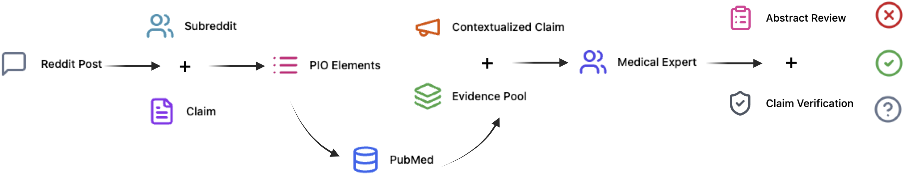
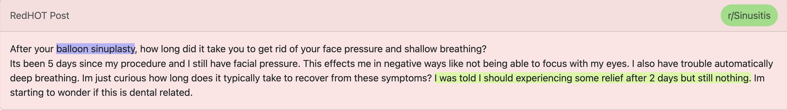
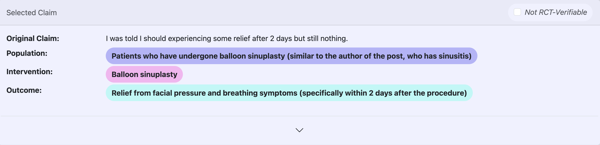
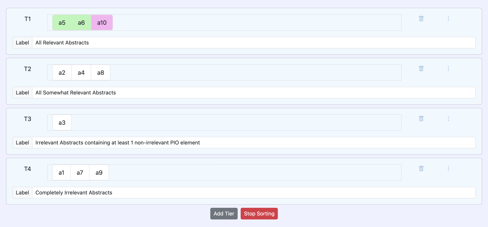
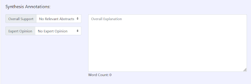
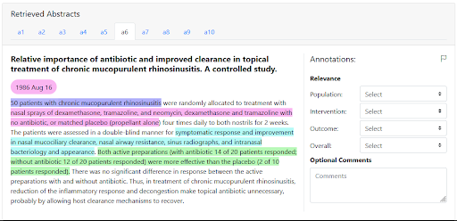

# Decide less, communicate more: On the construct validity of end-to-end fact-checking in medicine

This is the repository where we release the annotation data and interface described in our paper: "Decide less, communicate more: On the construct validity of end-to-end fact-checking in medicine".

Please contact Sebastian Joseph (sebaj@utexas.edu) or Lily Chen (l1ly@mit.edu) if you need access to any of the data or code not found in this repository.

# Annotation Interface
To explore the annotations:
1. Visit the viewer [Annotation Interface](https://sebajoe.github.io/redhot_viewer/)
2. Upload the corresponding `.json` file from the `annotation_data/` or `retrieval_test/` folders

# Repository Structure
`annotation_data/` 
* Contains annotations from six annotators
* Covers three splits. Split 1: First pilot set of 10 claims, split 2: refinement set of 5 claims, split 3: final set of 5 claims.

`retrieval_test/` 
* Includes `.json` files for eight different RCT abstract retrieval strategies
* `relevance_anno/` has eight `.json` files with the relevance annotated for each RCT abstract

`redhot_viewer`
* Source code for the annotation interface.

## Citation
Coming soon.
