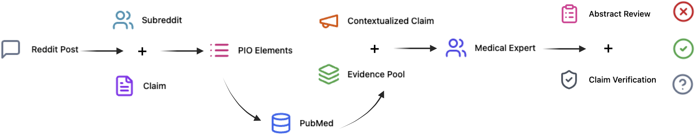
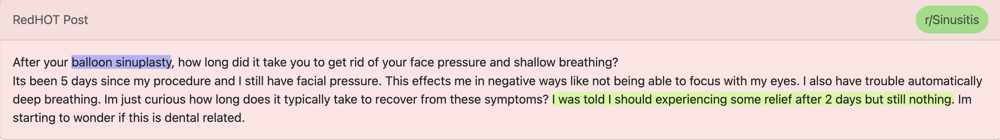
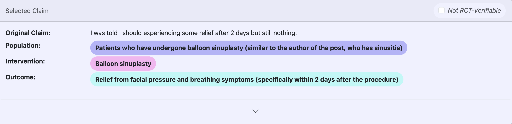
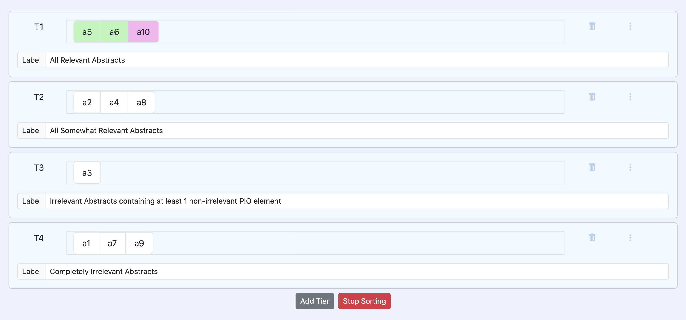
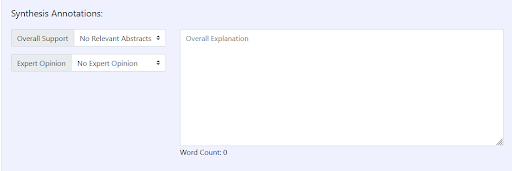
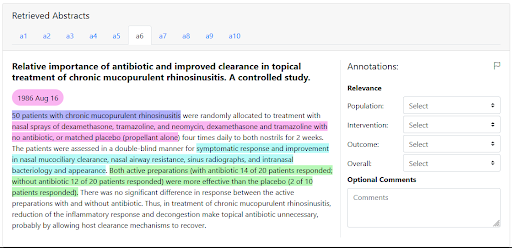

# Decide less, communicate more: On the construct validity of end-to-end fact-checking in medicine

This is the repository where we release the annotation data and interface described in our paper: ["Decide less, communicate more: On the construct validity of end-to-end fact-checking in medicine"](https://aclanthology.org/2026.findings-acl.496/).



Please contact Sebastian Joseph (sebaj@utexas.edu) or Lily Chen (l1ly@mit.edu) if you need access to any of the data or code not included in this repository.

# Annotation Interface
To explore the annotations:
1. Visit the viewer: [Annotation Interface](https://sebajoe.github.io/redhot_viewer/)
2. Upload the corresponding `.json` file from the `annotation_data/` or `retrieval_test/` folders






> 💡 If you'd like to perform your own annotations using the interface, ensure your data follows the same `.json` format as used in this study. For annotation instructions used in our study, see [this presentation](https://docs.google.com/presentation/d/1hz-jw6UKyi0cDkzWuJoKoLTYP4ejuqwR-WPpuZMTg7o/edit?slide=id.g33d47a9936b_0_0#slide=id.g33d47a9936b_0_0).

# Repository Structure
`annotation_data/` 
* Annotations from six annotators
* Each medical claim is paired with 10 retrieved RCT abstracts
* Covers three splits:
  * **Split 1**: First pilot set of 10 claims
  * **Split 2**: Refinement set of 5 claims
  * **Split 3**: Final set of 5 claims
* Filenames follow the format `<annotatorID>_split<splitNumber>.json` (e.g., `3_split1.json`)
* Note: Annotator 4 was unavailable for the third split, so `4_split3.json` is not included

`retrieval_test/` 
* Contains `.json` files for eight retrieval strategies, each applied to 5 medical claims
* The `relevance_anno/` folder contains manual relevance annotations for each strategy and retrieved abstract

`redhot_viewer`
* Linked repository containing the source code for the annotation interface

# Citation
If you found any of these resources useful, please consider citing [our paper](https://aclanthology.org/2026.findings-acl.496/).

```{bibtex}
@inproceedings{joseph-etal-2026-decide,
    title = "Decide less, communicate more: On the construct validity of end-to-end fact-checking in medicine",
    author = "Joseph, Sebastian Antony  and
      Chen, Lily  and
      Wei, Barry  and
      Mackert, Michael  and
      Marshall, Iain James  and
      Liang, Paul Pu  and
      Kouzy, Ramez  and
      Wallace, Byron C  and
      Li, Junyi Jessy",
    editor = "Liakata, Maria  and
      Moreira, Viviane P.  and
      Zhang, Jiajun  and
      Jurgens, David",
    booktitle = "Findings of the {A}ssociation for {C}omputational {L}inguistics: {ACL} 2026",
    month = jul,
    year = "2026",
    address = "San Diego, California, United States",
    publisher = "Association for Computational Linguistics",
    url = "https://aclanthology.org/2026.findings-acl.496/",
    doi = "10.18653/v1/2026.findings-acl.496",
    pages = "10196--10221",
    ISBN = "979-8-89176-395-1",
    abstract = "Technological progress has led to concrete advancements in tasks that were regarded as challenging, such as automatic fact-checking. Interest in adopting these systems for public health and medicine has grown due to the high-stakes nature of medical decisions and challenges in critically appraising a vast and diverse medical literature. Evidence-based medicine connects to every individual, and yet the nature of it is highly technical, rendering the medical literacy of majority users inadequate to sufficiently navigate the domain. Such problems with medical communication ripen the ground for end-to-end fact-checking agents: check a claim against current medical literature and return with an evidence-backed verdict. And yet, such systems remain largely unused.In this position paper, developed with expert input, we present the first study examining how clinical experts verify real claims from social media by synthesizing medical evidence. In searching for this upper-bound, we reveal fundamental challenges in end-to-end fact-checking when applied to medicine: Difficulties connecting claims in the wild to scientific evidence in the form of clinical trials; ambiguities in underspecified claims mixed with mismatched intentions; and inherently subjective veracity labels. We argue that fact-checking should be approached as an interactive communication problem, rather than an end-to-end process."
}
```
