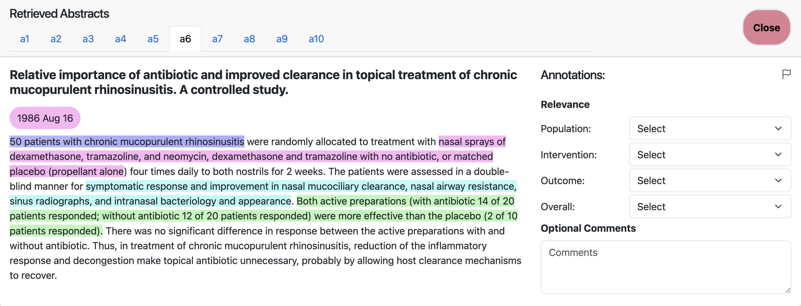

# Decide less, communicate more: On the construct validity of end-to-end fact-checking in medicine

This is the repository where we release the annotation data and interface described in our paper: ["Decide less, communicate more: On the construct validity of end-to-end fact-checking in medicine"](https://arxiv.org/abs/2506.20876).


Please contact Sebastian Joseph (sebaj@utexas.edu) or Lily Chen (l1ly@mit.edu) if you need access to any of the data or code not included in this repository.

# Annotation Interface
To explore the annotations:
1. Visit the viewer: [Annotation Interface](https://sebajoe.github.io/redhot_viewer/)
2. Upload the corresponding `.json` file from the `annotation_data/` or `retrieval_test/` folders



> 💡 If you'd like to perform your own annotations using the interface, ensure your data follows the same `.json` format as used in this study. For annotation instructions used in our study, see [this presentation](https://docs.google.com/presentation/d/1hz-jw6UKyi0cDkzWuJoKoLTYP4ejuqwR-WPpuZMTg7o/edit?slide=id.g33d47a9936b_0_0#slide=id.g33d47a9936b_0_0).

# Repository Structure
`annotation_data/` 
* Annotations from six annotators
* Each medical claim is paired with 10 retrieved RCT abstracts
* Covers three splits:
  * **Split 1**: First pilot set of 10 claims
  * **Split 2**: Refinement set of 5 claims
  * **Split 3**: Final set of 5 claims
* Filenames follow the format `<annotatorID>_split<splitNumber>.json` (e.g., `3_split1.json`)
* Note: Annotator 4 was unavailable for the third split, so `4_split3.json` is not included

`retrieval_test/` 
* Contains `.json` files for eight retrieval strategies, each applied to 5 medical claims
* The `relevance_anno/` folder contains manual relevance annotations for each strategy and retrieved abstract

`redhot_viewer`
* Linked repository containing the source code for the annotation interface

# Citation
If you found any of these resources useful, please consider citing [our paper](https://arxiv.org/abs/2506.20876).

```{bibtex}
@misc{joseph2025decidelesscommunicatemore,
      title={Decide less, communicate more: On the construct validity of end-to-end fact-checking in medicine}, 
      author={Sebastian Joseph and Lily Chen and Barry Wei and Michael Mackert and Iain J. Marshall and Paul Pu Liang and Ramez Kouzy and Byron C. Wallace and Junyi Jessy Li},
      year={2025},
      eprint={2506.20876},
      archivePrefix={arXiv},
      primaryClass={cs.CL},
      url={https://arxiv.org/abs/2506.20876}, 
}
```
